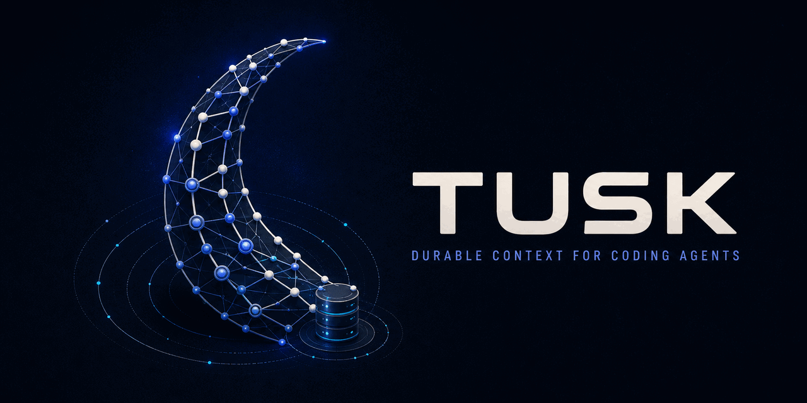

# Tusk

**Durable context and task orchestration for coding agents.**

[](https://github.com/gioe/tusk/actions/workflows/integration.yml)
[](https://github.com/gioe/tusk/releases/latest)



Tusk turns a Git repository into a local, agent-operable work system. It gives Claude Code and Codex a shared SQLite task database, a single CLI, and native workflows for planning, isolated implementation, verification, review, handoff, and autonomous backlog execution.

The result is continuity beyond the current chat: a future agent can recover what matters, why it matters, what was tried, what remains, and what proves the work is done.

Tusk is local-first. It runs from your repository, stores project state in SQLite, and requires no hosted Tusk service.

## Why Tusk?

Coding agents are effective inside a session. Software projects are not confined to one.

Without durable structure, context gets flattened into chat history, TODO files, or issue prose. Decisions disappear, “done” becomes subjective, interrupted work is expensive to resume, and autonomous runs repeat discovery that a previous session already paid for.

Tusk makes context handoff part of the development workflow:

```text
Objective  →  Task  →  Criteria  →  Verification
                 ↘  progress, decisions, risks, reviews, cost, next steps
```

- **Objectives** preserve initiative-level intent across multiple changes.
- **Tasks** are independently shippable units with their own workspace and history.
- **Criteria** define the observable promises a task must satisfy.
- **Verifications** provide executable or reviewable proof.
- **Context atoms** retain compact decisions, assumptions, risks, questions, memories, and entry points.

Agents read only the relevant slice at pickup and write back what the next session needs.

## What Tusk Does

| Capability | What it provides |
|---|---|
| Durable handoff | Compiled task briefs, progress checkpoints, next steps, context atoms, and objective rollups |
| Isolated execution | Task-owned Git worktrees and short-lived feature branches for concurrent agent work |
| Verifiable completion | Manual, test, code, and file criteria with recorded completion evidence |
| Workflow control | Readiness, dependency DAGs, scope guards, duplicate detection, review gates, and merge semantics |
| Autonomous operation | Backlog grooming, dependency chains, objective execution, looped task dispatch, and proposed follow-up work |
| Observability | Session duration, token and cost attribution, review history, task summaries, dashboards, and health audits |
| Self-improvement | Jots, retrospectives, recurring-theme detection, lint rules, and prioritized process follow-ups |
| Cross-agent support | Claude Code skills and Codex prompt ports backed by the same CLI and database |

## Quick Start

### 1. Install Tusk into a Git project

```bash
git clone https://github.com/gioe/tusk.git /path/to/tusk

cd /path/to/your-project
/path/to/tusk/install.sh
```

The target project must identify its agent environment:

- **Claude Code:** a `.claude/` directory is present. Tusk installs its CLI, skills, and Git-event hooks under `.claude/`.
- **Codex:** an `AGENTS.md` file is present and `.claude/` is absent. Tusk installs the CLI under `tusk/bin/` and prompt ports under `.codex/prompts/`.

Installation creates project configuration at `tusk/config.json` and the local database at `tusk/tasks.db`.

### 2. Configure the project

For Claude Code, start a new session so the installed skills are discovered, then run:

```text
/tusk-init
```

For Codex or a terminal-first setup, run:

```bash
tusk init-wizard
```

The wizard can scan an existing codebase or capture a fresh project's intent. It proposes domains, task types, agents, test commands, project memory, starter files, utility modules, and an initial vertical-slice backlog before writing anything.

### 3. Start working

Let the agent select the highest-priority ready task:

```text
/tusk
```

Or use the CLI directly:

```bash
tusk task-list
tusk task-start TASK-42
tusk task-worktree create TASK-42 short-slug
tusk task-brief TASK-42 --format markdown
```

## The Task Lifecycle

Tusk's default workflow is reviewed trunk-based development with isolated task workspaces:

```text
select → start → create worktree → implement → verify → commit → review → merge → retro
```

1. `task-select` chooses ready work using priority, dependencies, timing, and workflow rules.
2. `task-start` opens a tracked session and hydrates task context.
3. `task-worktree create` creates an isolated workspace on `feature/TASK-N-slug`.
4. `tusk commit` runs the configured test gate and records task-aware commits.
5. Criteria are verified and linked to completion evidence.
6. AI review records findings and resolutions against the task diff.
7. `tusk merge` fast-forwards locally by default, or uses a pull request when configured.
8. Retrospectives turn friction and recurring patterns into durable improvements.

Branches remain the version-control handle; pull requests are optional. This keeps the default workflow lightweight while preserving a CI or human-review path when a project needs one.

## Workflows for Agents

Tusk ships parallel Claude Code skills and Codex prompt ports for its major workflows.

| Workflow | Purpose |
|---|---|
| `tusk` | Select or resume one task and carry it through implementation, review, and merge |
| `create-task` | Convert requirements, bugs, notes, or investigations into structured, deduplicated tasks |
| `resume-task` | Recover interrupted work from task state, branch history, and progress checkpoints |
| `chain` | Execute a dependency sub-DAG in ready order |
| `objective` | Decompose and drive a multi-task initiative through completion |
| `loop` | Continue through ready backlog work until a stop condition or empty backlog |
| `groom-backlog` | Close stale work, detect duplicates, repair scope, and normalize priority |
| `review-commits` | Review task commits, fix blocking findings, and preserve follow-ups |
| `retro` | Capture process friction, themes, lint rules, and improvement tasks |
| `investigate` | Research a problem and produce an evidence-based assessment before task creation |
| `tusk-insights` | Audit database health, workflow quality, cost, and task metrics |

Claude Code can use native multi-agent execution where supported. Codex uses sequential prompt ports around the same deterministic CLI orchestrators and durable state.

## Autonomous and Multi-Task Work

Tusk understands more than a flat backlog:

- **Dependencies** distinguish blocking prerequisites from contingent work.
- **Chains** traverse ready tasks in dependency order.
- **Objectives** group shippable tasks under a larger outcome without turning the outcome into one oversized task.
- **Loops** drain ready work and surface ranked proposals when the backlog is empty.
- **Bakeoffs** run the same task under multiple models in isolated worktrees and let you select the winning implementation.
- **Scope enforcement** keeps commits inside the paths declared by the task and flags drift before merge.

```bash
tusk deps ready
tusk chain status TASK-42
tusk objective brief OBJ-7 --format markdown
tusk loop --dry-run
tusk bakeoff TASK-42 --models model-a,model-b
```

## Observability

Every task can retain its session, model, token usage, estimated cost, duration, diff size, review history, criteria evidence, and next steps.

```bash
tusk task-summary TASK-42 --format markdown
tusk objective brief OBJ-7 --format markdown
tusk session-stats
tusk call-breakdown TASK-42
tusk insights
tusk dashboard
```

`tusk dashboard` produces a self-contained HTML view of backlog health, task metrics, costs, skill runs, and dependency structure. No separate server is required.

## Configuration

Tusk adapts to a project through `tusk/config.json` rather than source edits:

```json
{
  "domains": ["frontend", "backend", "infrastructure", "docs"],
  "task_types": ["bug", "feature", "refactor", "test", "docs"],
  "priorities": ["Highest", "High", "Medium", "Low", "Lowest"],
  "complexity": ["XS", "S", "M", "L", "XL"],
  "test_command": "python3 -m pytest tests/unit/ -q",
  "review": {
    "mode": "ai_only",
    "max_passes": 2
  },
  "merge": {
    "mode": "local"
  }
}
```

Config drives validation, ranking, assignment, test gates, review behavior, merge policy, bootstrap packs, sparse worktree cones, and project-specific workflows. Run `tusk regen-triggers` after changing validated enum values in an existing installation.

## Local-First Architecture

The `tusk` wrapper is the single source of truth for project paths and command dispatch:

```text
agent skill or prompt
        ↓
     tusk CLI
        ↓
 local SQLite database + Git worktrees + project config
```

- SQLite provides portable state, migrations, validation triggers, WAL concurrency, and auditable history.
- Bash provides the stable command surface and project-path resolution.
- Focused Python helpers implement deterministic operations behind CLI subcommands.
- Git worktrees isolate concurrent tasks without requiring a hosted coordinator.
- Skills and prompts provide agent-specific interaction while keeping workflow state agent-neutral.

Tusk does not upload the task database to a Tusk service. Commands that intentionally integrate with GitHub, fetch upgrades, or refresh model pricing use the corresponding external service explicitly.

## Upgrade Safely

From an installed project:

```bash
tusk upgrade
```

Upgrades replace managed CLI, skill, prompt, and hook files, then apply schema migrations. They do not overwrite `tusk/config.json` or `tusk/tasks.db`.

## Documentation

- [Product pillars](docs/PILLARS.md) — the values used to resolve design tradeoffs
- [Domain model](docs/DOMAIN.md) — schema, views, invariants, and lifecycle rules
- [Skills and workflows](docs/SKILLS.md) — agent workflow reference
- [Codex support](docs/CODEX.md) — installation layout and parity notes
- [Git hooks](docs/HOOKS.md) — dispatcher contract and installed guards
- [Migrations](docs/MIGRATIONS.md) — schema evolution rules and templates
- [CLI helpers](docs/SCRIPTS.md) — command implementation reference
- [Changelog](CHANGELOG.md) — release history

## Development

```bash
python3 -m pip install -r requirements-dev.txt
python3 -m pytest tests/unit/ -q
python3 -m pytest tests/integration/ -q
```

The unit suite is the local commit gate. The full hermetic integration suite runs in GitHub Actions for pull requests and pushes to `main`.

See [CONTRIBUTING.md](CONTRIBUTING.md) for the contribution workflow and [SECURITY.md](SECURITY.md) for responsible vulnerability reporting.

## Feedback

- Browse or report issues in [GitHub Issues](https://github.com/gioe/tusk/issues).
- For a problem observed in an installed project, use the [Tusk instance feedback form](https://github.com/gioe/tusk/issues/new?template=tusk-instance-feedback.yml) and include a runnable reproduction.
- Do not patch managed `.claude/bin/` or `tusk/bin/` copies in a consumer project; contribute fixes to this source repository instead.
